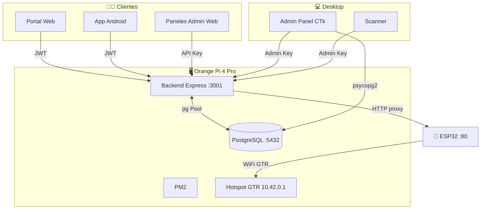

# 🗺️ Mapa General — Parking GTR

> **TL;DR** — Sistema de estacionamiento premium: Backend Node.js + PostgreSQL, Admin Desktop CustomTkinter, ESP32 dual-gate, Web + Android. Deploy en Orange Pi 4 Pro.

---

## 🧭 Navegación Rápida

| # | Documento | Descripción | Link |
|---|-----------|-------------|------|
| 01 | Estructura de Carpetas | Árbol completo de archivos | [[01_Estructura_de_Carpetas]] |
| 02 | Backend API | Express + PostgreSQL, 38+ endpoints | [[02_Backend_API_NodeJS]] |
| 03 | Admin Panel | Desktop CustomTkinter + Scanner | [[03_Admin_Panel_Python]] |
| 04 | ESP32 Bridge | Firmware Arduino, dual-gate | [[04_ESP32_Bridge_IoT]] |
| 05 | Frontend Web | Landing, reservas, paneles admin | [[05_Frontend_Web_Portal]] |
| 06 | Android App | Kotlin, parking + membresías | [[06_Android_Mobile_App]] |
| 07 | Integración | Flujos E2E, puertos, deploy | [[07_Notas_de_Integracion]] |
| 08 | Dataview Queries | Consultas dinámicas Obsidian | [[08_Obsidian_Dataview_Queries]] |
| 09 | Kanban | Estado de tareas del proyecto | [[09_Kanban_Estado_Proyecto]] |

---

## 🏗️ Arquitectura

---

## 🛠️ Stack

| Capa | Tecnología | Versión |
|------|-----------|---------|
| Backend | Express | ^4.21.2 |
| DB | PostgreSQL (pg) | ^8.13.1 |
| Auth | jsonwebtoken | ^9.0.3 |
| Hash | bcrypt | ^6.0.0 |
| Seguridad | helmet / rate-limit | ^8.1.0 / ^8.3.2 |
| Admin | CustomTkinter + psycopg2 | Python 3.11 |
| IoT | Arduino C++ (ESP32) | ESP32Servo |
| Frontend | HTML/CSS/JS Vanilla | ES6+ |
| Mobile | Kotlin + Android SDK | 34 |
| Deploy | Orange Pi 4 Pro + PM2 | Armbian |

---

## 📊 Estado

| Módulo | Progreso | Estado |
|--------|----------|--------|
| Backend API | 95% | 🟢 Funcional |
| Admin Panel | 85% | 🟢 Funcional |
| ESP32 Bridge | 90% | 🟢 Funcional |
| Frontend Web | 80% | 🟢 Funcional |
| Android App | 45% | 🟡 En desarrollo |
| Documentación | 90% | 🟢 Actualizada |

---

## 🏷️ Tags de Obsidian

- `#gtr` — Todo el proyecto
- `#backend` / `#api` — Servidor Node.js
- `#admin` / `#scanner` — Panel Desktop Python
- `#esp32` / `#iot` / `#hardware` — Firmware ESP32
- `#frontend` / `#web` — Portales web
- `#android` / `#mobile` — App Android
- `#despliegue` — Deploy en Orange Pi
