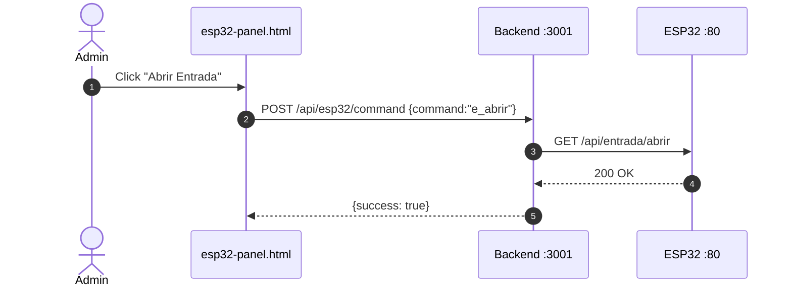

# 🔄 Integración & Deploy

> **TL;DR** — Flujos E2E entre módulos, mapa de puertos, mecanismos de auth, y procedimientos de despliegue en Orange Pi.

⬅️ [[06_Android_Mobile_App]] · [[00_MAPA_GENERAL_GTR|🗺️ Mapa]] · [[08_Obsidian_Dataview_Queries]] ➡️

---

## 🔌 Mapa de Puertos

| Servicio | Puerto | Host |
|----------|--------|------|
| Backend API | 3001 | Orange Pi |
| PostgreSQL | 5432 | Orange Pi |
| ESP32 WebServer | 80 | IP dinámica (registrada) |
| Admin Panel | — | Desktop (sin puerto) |
| Hotspot GTR | — | 10.42.0.1 (wlan0) |
| Tailscale VPN | — | 100.89.43.30 |

---

## 🔐 Mecanismos de Auth

| Origen → Destino | Método |
|-------------------|--------|
| Frontend → Backend | `Authorization: Bearer <JWT>` |
| Android → Backend | `Authorization: Bearer <JWT>` |
| Admin Panel → Backend | `X-API-Key: <ADMIN_API_KEY>` |
| Scanner → Backend | `X-API-Key: <ADMIN_API_KEY>` |
| ESP32 → Backend | Sin auth (solo `POST /api/esp32/register`) |
| Backend → ESP32 | HTTP directo a IP del ESP32 |
| Admin Panel → PostgreSQL | psycopg2 directo |

---

## 🔄 Flujo 1: Escaneo de Membresía

```mermaid
sequenceDiagram
    autonumber
    actor M as Miembro
    participant SC as Scanner Python
    participant API as Backend :3001
    participant AND as Android Display

    M->>SC: Presenta QR / tarjeta
    SC->>API: POST /api/scan-event {member_name}
    API-->>SC: 200 OK
    AND->>API: GET /api/scan-event (polling 3s)
    API-->>AND: {event: {member_name, event_type}}
    AND->>AND: Muestra bienvenida
    AND->>API: DELETE /api/scan-event
```

---

## 🔄 Flujo 2: Control Remoto de Puerta



---

## 🖥️ Deploy en Orange Pi

### 🚀 Orden de Inicio

1. **PostgreSQL** — debe estar corriendo
2. **Backend API** — `pm2 start ecosystem.config.js`
3. **Admin Panel / Scanner** — `python run_admin.py` o `run_scanner.py`
4. **Frontend** — archivos estáticos (file:// o live server)

### 📜 Scripts de Deploy

| Script | Función |
|--------|---------|
| `deploy_orangepi.py` | SSH → sync NTP → git pull → npm install → pm2 restart |
| `deploy.sh` | Deploy automatizado bash |
| `deploy_esp32_panel.py` | Actualiza panel web ESP32 |
| `fix_hotspot.py` | Levanta hotspot GTR si se pierde WiFi |
| `get_logs.py` | Extrae logs del sistema |

### ✅ Checklist de Verificación

- [ ] `GET /api/health` → `{"status":"ok","db":"connected"}`
- [ ] ESP32 LED GPIO 2 parpadeando (WiFi conectado)
- [ ] `run_scanner.py` → beep al leer QR de prueba
- [ ] `timedatectl status` → NTP sincronizado
- [ ] Hotspot GTR visible en dispositivos

---

⬅️ [[06_Android_Mobile_App]] · [[00_MAPA_GENERAL_GTR|🗺️ Mapa]] · [[08_Obsidian_Dataview_Queries]] ➡️
